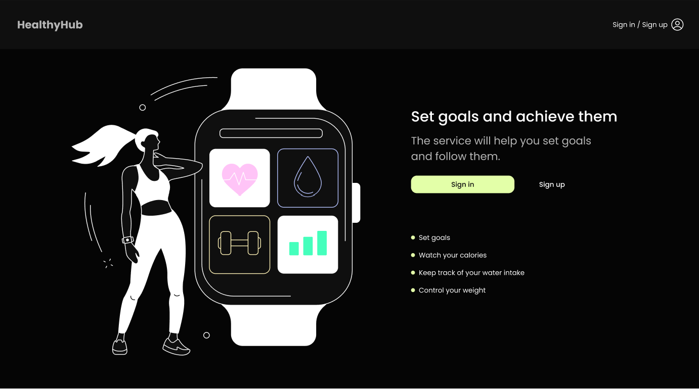
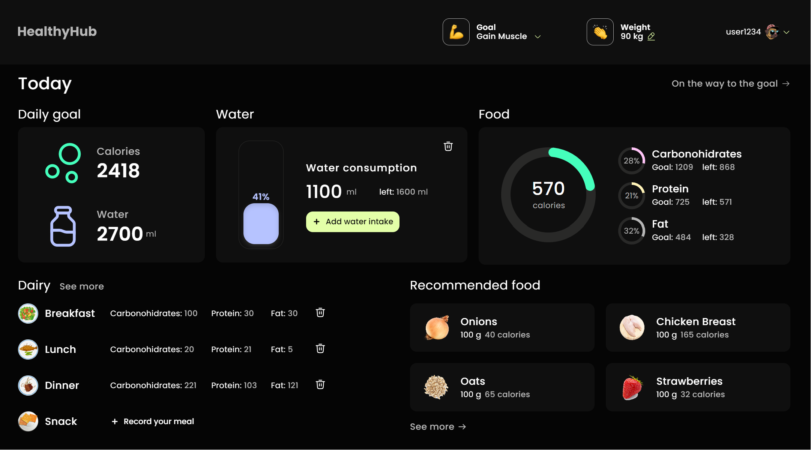
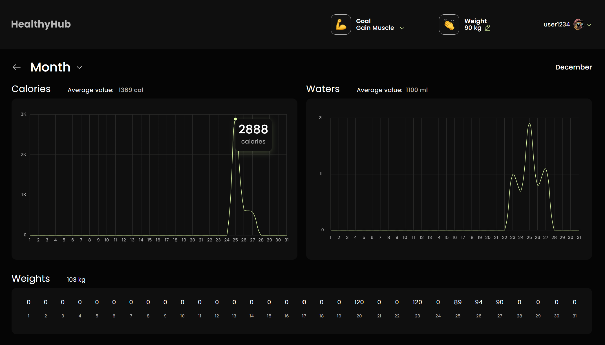
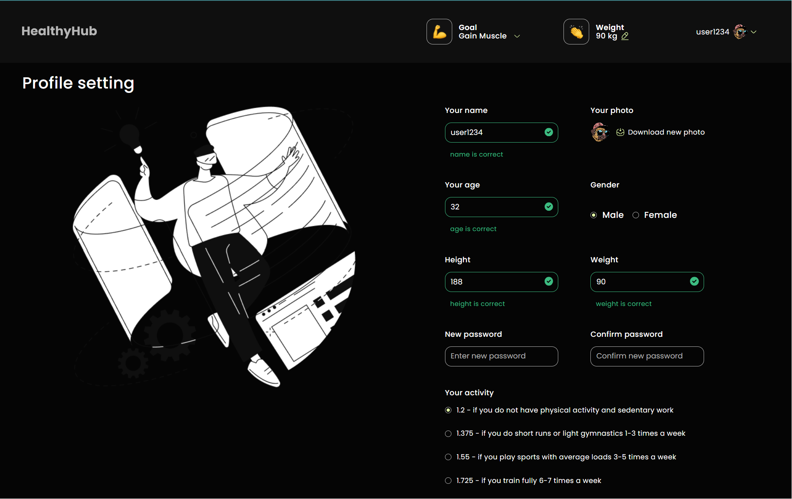

# Healthy Hub - FS84 - ProjectGroup 3



HealthyHub, an easy-to-use React app, is designed to smoothly help you manage
your health and wellness efforts. If your objectives are to keep track of your
daily calorie intake, monitor your water consumption, or set fitness targets,
HealthyHub is your ideal partner.

## Links

- 🖼️ FRONTEND - https://songlad.github.io/HEALTH_EN/
- ✨ FRONTEND REPO - https://github.com/SonGlad/HEALTH_EN

- 🛠️ BACKEND REPO - https://github.com/Sheremeta-Ivan/HEALTH_EN_BACKEND
- 🔗 API_URL - https://healthy-hub-backend-fs5j.onrender.com
- 📄 API_DOCS(Swagger) - https://healthy-hub-backend-fs5j.onrender.com/api-docs

## Features

:runner: **Calorie Tracking**: Keep an extensive record of your daily calorie
intake so you can make informed decisions about what you eat.<br />

:sweat_drops: **Hydration Monitoring**: Make sure you stay optimally hydrated by
keeping track of how much water you drink every day and setting goals for your
water consumption.<br />

:weight_lifting: **Fitness Tracking**: Set fitness goals and track your progress

:notebook_with_decorative_cover: **Comprehensive Food Diary**: Effortlessly log
your daily meals and snacks with detailed descriptions for easy organization and
analysis. Reflect on your eating habits and identify areas for improvement.

:corn: **Nutrition Insights**: Get access to detailed nutritional information
for many different foods, which helps you make healthy choices when
eating.<br />

:computer: **User-Friendly Interface**: The intuitive and responsive design of
HealthyHub is easy to use for people of all ages.<br />

:chart_with_upwards_trend: **Data Visualization**: See your progress and
accomplishments illustrated through interactive charts and graphs.

:lock: **Privacy and Security**: HealthyHub prioritizes your privacy and
security. Your personal information and health data are protected with
industry-standard encryption and strict privacy policies. Feel confident that
your data is safe and confidential.

##

 The home page shows 5 small blocks where the
user can monitor their daily water and calorie targets. There is also a view of
a diary with meals and the ability to remove them. Additionally, the app has a
function to create customized food suggestions tailored to the user's
nutritional requirements.

##

 On the Dashboard page, the user can view
their results and accomplishments month-by-month in the form of clear and
user-friendly charts.

##

 The Settings page allows the user to set their
main information likes name, age, weight, goals and many others. The user can
also change their password. The page also has a function to update the avatar.

## Technologies

<p align="center">
  <b>HealthyHub frontend part is built using the following technologies & tools:</b>
</p>
<p align="center">
  &nbsp;
  &nbsp;
  &nbsp;
  &nbsp;
  &nbsp;
  &nbsp;
  &nbsp;
  &nbsp;
  &nbsp;
  &nbsp;
  &nbsp;
  &nbsp;
  &nbsp;
  &nbsp;
  &nbsp;

</p>

<p align="center">
  <b>HealthyHub backend part is built using the following technologies & tools:</b>
</p>
<p align="center">
  &nbsp;
  &nbsp;
  &nbsp;
  &nbsp;
  &nbsp;
  &nbsp;
  &nbsp;
  &nbsp;
</p>

## Installation

1. Clone the repo

```sh
git clone
```

2. Install NPM packages

```sh
npm install
```

3. Run the app

```sh
npm start
```

4. Open the app in your browser

```sh
http://localhost:3000
```

5. Enjoy!

## Contributors

- **Team lead:** [Oleg Koshevy](https://github.com/SonGlad)
- **Scrum maister:** [Rodion Tomm](https://github.com/tomm-rodion)
- **Team lead of BACKEND:** [Ivan Sheremeta](https://github.com/Sheremeta-Ivan)

- **Developers:** [Anastasiia Marchuk](https://github.com/AnastasiiaMarchuk) |
  [Gritchin Artur](https://github.com/gritchin-artur) |
  [Paladiichuk Liudmyla](https://github.com/Lyudmyla26) |
  [Daniil Drozd](https://github.com/DaniilDrozd) |
  [Kateryna Chubach](https://github.com/kgonchuk) |
  [Vasyl Poburyanyi](https://github.com/Mario031281) |
  [Tetiana Maryniak](https://github.com/MaryniakT) |
